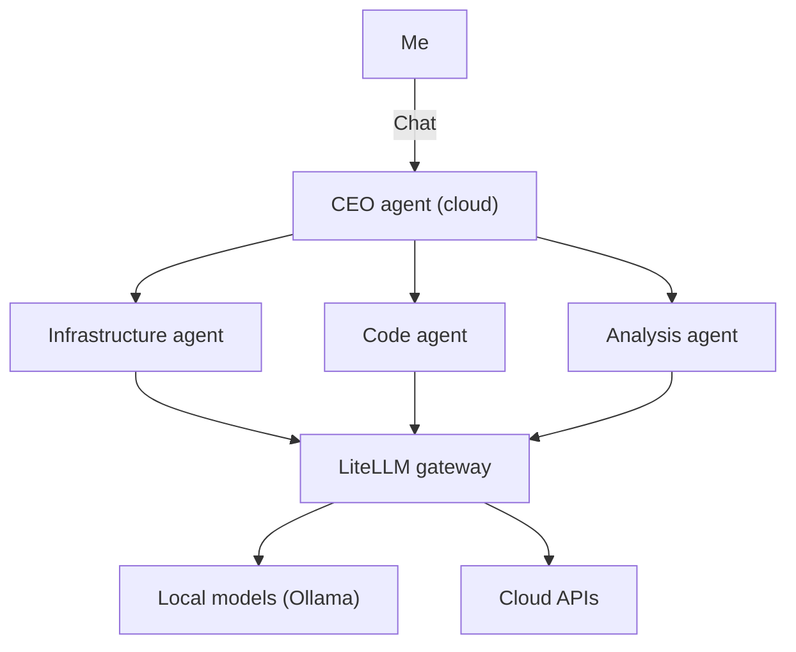
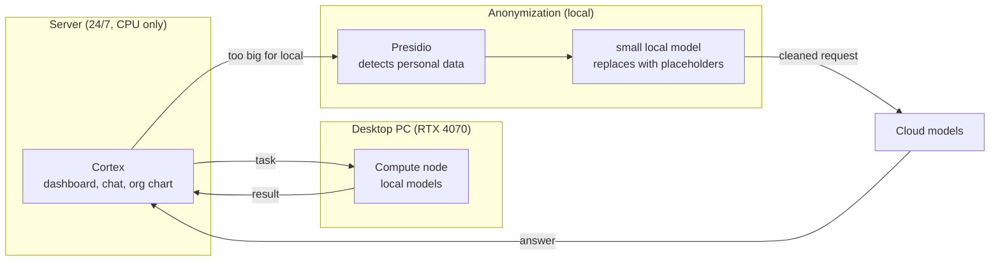
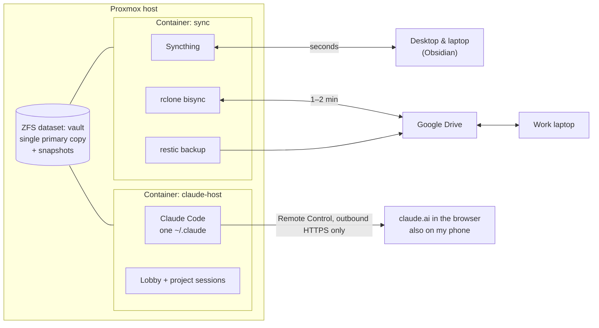

I work a lot with AI agents: for the homelab, for code, for my apprenticeship. The question
was never *whether* I use them, but *where they run* and *how they know what I know*. To get
to today's solution, I built three architectures. The first two failed, and those are exactly
the ones I'm telling you about here, because you learn more from them than from the end
result.

## Attempt 1: Cortex, the command center (April)

### The idea: one place for everything I do with AI

Early this year, Claude Code and similar tools became noticeably powerful. No longer just
chat with code snippets, but agents that read, plan, run commands and check their own work
on their own. I didn't want to tap into that value only now and then, I wanted to **build it
into my daily routine**. So I taught myself through videos and posts how to really work with
(agentic) AI: building context properly, breaking tasks down, giving agents tools.

That turned into **Cortex**: my central point of interaction with AI. A self-built dashboard
through which I talk to all agents and control my entire homelab. On paper there were
**twelve modules**: agent orchestration, workflow engine, MCP management, monitoring,
ticketing, documentation, remote access, Proxmox integration and the dashboard itself.

### The AI org chart

The shape of it came from **Mario Alka**, who kept showing a very similar system in his
TikTok videos: AI agents organized like a company, with clear roles and a hierarchy. I
already had the basic idea in my head; his videos showed me what it could look like in
practice, and I borrowed a few things and let myself be inspired.

So at its heart was a **"CEO agent"**: a cloud model that understands tasks and delegates
them to three specialized sub-agents. One for infrastructure, one for code, one for analysis,
each with its own model, all behind a shared LiteLLM gateway. In the dashboard you saw this
as an interactive org chart, and every delegation showed up live in the chat.

### The hardware problem: a homelab, not a data center

The decisive difference from Mario: he has a company behind him and can set up his own AI
servers. I have a **small server without a GPU** and a **desktop PC with a gaming GPU (RTX
4070, 12 GB)** that can run local models at least to some extent.

That led to the **multi-host idea**: Cortex itself runs around the clock on the server, and
the compute work is offloaded to the desktop PC. The PC registers with Cortex as a compute
node, brings its own models, does the work and sends the result back to the server, where it
shows up in the chat. More nodes were supposed to join later just as easily, whether on the
LAN or over VPN.

But even the 4070 sets tight limits: with 12 GB of VRAM, only smaller models fit, and they
can't match the big cloud models on demanding tasks. So there was no way around the cloud.
And because my homelab also holds data that is no cloud provider's business, the next
building block was an **anonymization pipeline**: before a request leaves the house,
Presidio detects personal data, a small local model replaces it with placeholders, and only
the cleaned version goes to the cloud.

### What became of it

I built quite a lot of it: **127 commits in just over two weeks**, a Next.js dashboard with
Postgres, an alert panel, monitoring integration and a chat interface with streaming. The
distributed architecture with compute nodes was worked out as the next step.

In June, I shut the whole stack down anyway. The reason in the ticket: work continues only
with new hardware or much better local models. Cortex remained a **wish concept**. With my
hardware and the public models that run on it, the system would never have met my
requirements: the sub-agents would either have been too weak or would have ended up passing
almost everything on to the cloud anyway, just with more detours.

Looking back, there's a second lesson in it: **I had built the command center before I knew
what I wanted to command from it.** Twelve modules for a single user, separate interfaces for
tickets and documentation running alongside Obsidian, and a delegation chain that mostly
looked nice. In the end, most of the value came from what already existed: Claude Code in the
terminal. I didn't give up on the idea of a central point of interaction, though; it just
came back by a different route, as attempt 3 shows.

## Attempt 2: Three instances, one shared brain (June to September)

So, back to the tool that worked: **Claude Code**, directly on my machines under WSL. The
desktop, my personal laptop and my work laptop each ran their own installation.

What connected them was a **shared brain** made of text files, which had been growing in its
own repo since March:

- an **index** through which every session loads only the knowledge it currently needs,
- a file of **past mistakes** and their fixes that every session reads before complex tasks
  (it's now almost 600 lines long and the source of my [pitfalls](/en/blog)),
- a shared **backlog** and **specifications** for every larger project,
- fixed rules: secrets only from the password manager, nothing destructive without asking,
  change only what was requested.

The principle was right, the distribution wasn't. After a few months, the three environments
had drifted apart: different projects, different plugins, different settings, chats that
existed on only one machine. And the obvious fixes all failed on details:

- **Syncing WSL via Google Drive:** WSL's virtual disk is locked while running and would be
  corrupted by syncing. Putting the home folder on the Drive mount is slow, loses permissions
  and symlinks, and breaks Git repos.
- **Syncing just the chats:** Claude Code stores its sessions in folders whose names are
  derived from the project path. User names and paths differed between my machines, so
  nothing matched up.
- **The Drive mount in WSL** regularly dropped out after running for a while ("No such
  device"), even though Drive kept running on Windows. My hourly job that mirrors the vault to
  GitHub as a backup hadn't written anything for six days because of it.
- **The work laptop** only reaches the internet over regular HTTPS. Getting around the company
  firewall with SSH or a VPN over port 443 was out of the question for me.

## Attempt 3: One host, one source of truth (since late September)

The turning point came with a simple question: why am I syncing Claude at all? **If Claude
runs in only one place, there's nothing left to sync.**

Within a week, that became today's system, two lean containers on my Proxmox host:

The rules behind it:

- **There is exactly one primary copy of the vault**, a ZFS dataset with regular snapshots.
  Everything else is a copy: Syncthing distributes changes to the machines at home within
  seconds, and a sync with Google Drive supplies the work laptop within one to two minutes.
- **No cloud drive is mounted anywhere.** If Google Drive goes down, only the sync with Drive
  goes down, not my work.
- **There is exactly one `~/.claude`**: all chats, plugins, settings and memory in one place.
  Code repos live on fast NVMe storage, not in the sync area.
- **Access only from the inside out.** Claude Code connects to claude.ai on its own via Remote
  Control. I use it in the browser, from the work laptop over regular HTTPS and on the go from
  my phone. No port is open in the homelab for this.
- **Every job checks in.** After each successful run, it sets a timestamp. A watchdog checks
  every ten minutes whether one is too old and then sends me an email.

### The lobby

So that I'm not staring at an empty session list when I'm away from home, exactly one small
session is always running: the **lobby**. It uses a cheap model, has no tools except "start,
stop and list projects", and is always online. I write "start mediastack", and a few seconds
later the project session appears in the app, with its previous history.

### The first outage: nine sessions, one frozen container

Two days after launch, the container froze. No SSH, no console, no remote session, for twenty
minutes. No crash, no OOM kill, but **swap thrashing**: around nine Claude sessions were
running in parallel, and each had taken about a gigabyte, because each had started its own
instances of the globally enabled MCP servers.

The fix had three parts:

- All sessions run in a dedicated **systemd slice with a hard memory limit**. SSH sits outside
  it and stays reachable even when the slice is full.
- A **reaper** runs every minute and ends sessions that haven't done anything for two hours.
  If memory gets tight anyway, there's an emergency brake.
- **Heavy MCP servers are no longer enabled globally**, only in the projects that need them.
  Since then, a session needs about 300 MB instead of a gigabyte.

### The vault joins in

With a stable foundation, the Obsidian vault could finally serve as a real working memory.
It's organized by areas of life (apprenticeship, bachelor's degree, work, personal, homelab),
every subject has a fixed structure, and my rough notes turn into polished study notes.

Since October 1, a **routine** runs every morning at five: a snapshot is taken, then a Claude
instance with no network access and a fixed list of allowed tools files new documents,
matches notes to the right subject using my class timetable, and creates separate notes for
deadlines. It deliberately started in **report mode**: it suggests, I review. Only once the
suggestions are right does it get to act on its own.

The backlog moved too, from one long Markdown file to **one file per ticket**, which Obsidian
displays as a table with status and priority.

### What went wrong during the rebuild

The rebuild had its own pitfalls, and all of them are now in the mistakes file:

- A manual **`rclone bisync --resync`** overwrote a newer change from Google Drive with an
  older version. Without further options, the resync always prefers the first side, no matter
  which one is newer. Since then it only runs with `--resync-mode newer`.
- A **failing test run** wrote into the real vault. The test already set the new environment
  variable, but the old script still read the old one and fell back to the real path.
- **Private folders** ended up in the (private) Git mirror of the vault, because an rsync
  exclude alone doesn't remove files that are already there. Since then, a guard checks before
  every commit whether anything from the private areas is included.
- New project sessions hung **invisibly in Claude Code's trust dialog**, because trust inside
  a Git repo isn't inherited from the parent folder. The launcher now sets it itself before
  every start.

## Takeaways

- **Problem first, architecture second.** Cortex solved a problem I didn't have. The real
  problem was much more mundane: where does Claude run, and how does it get to my notes?
- **One primary copy, many copies.** As soon as it was clear which copy is the truth,
  conflicts, backups and restores became simple.
- **Boring tools win.** Syncthing, tmux, systemd, ZFS snapshots and cron are less spectacular
  than an interactive agent org chart, but they run.
- **Limits from day one.** Memory limits, an idle reaper, report mode before going live: AI
  agents need the same guardrails as any other service, if anything more.
- **The shared brain was the right idea.** Index, mistakes file, backlog and specifications
  survived all three attempts. The only thing that changed is *where* they live.
