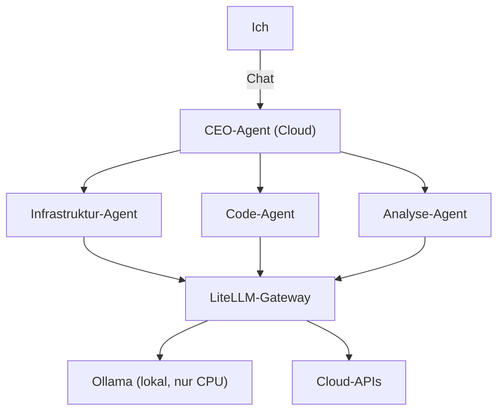
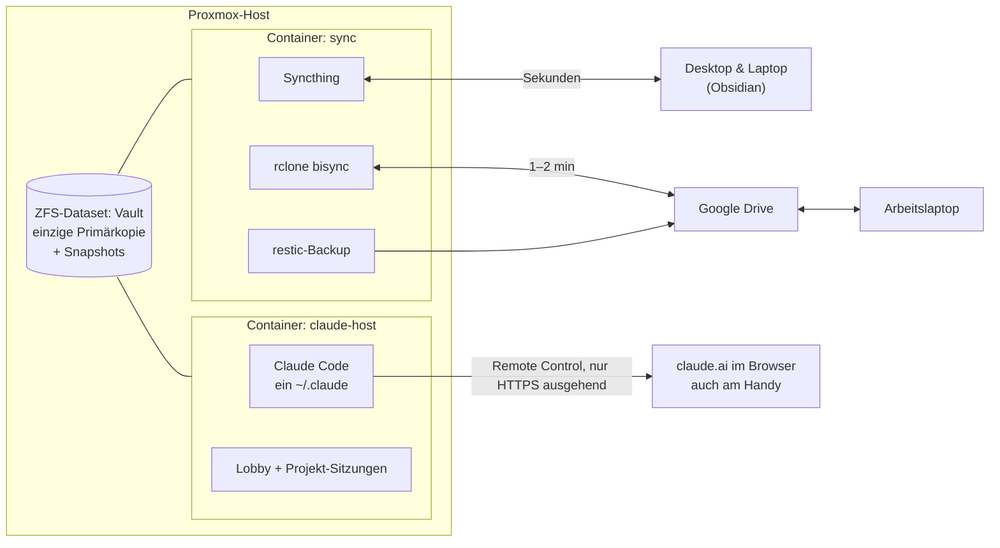

Ich arbeite viel mit KI-Agenten: für das Homelab, für Code, für die Ausbildung. Die Frage war nie, *ob* ich sie nutze, sondern *wo sie laufen* und *woher sie
wissen, was ich weiß*. Bis zur heutigen Lösung habe ich drei Architekturen gebaut. Die ersten
beiden sind gescheitert, und genau die erzähle ich hier mit, weil man aus ihnen mehr lernt
als aus dem Endergebnis.

## Anlauf 1: Cortex, die Kommandozentrale (April)

Die erste Idee war groß. **Cortex** sollte ein selbst gebautes Dashboard werden, das mein
gesamtes Homelab und alle KI-Agenten an einer Stelle steuert. Auf dem Papier standen
**zwölf Module**: Agenten-Orchestrierung, Workflow-Engine, MCP-Verwaltung, Monitoring,
Ticketsystem, Dokumentation, Fernzugriff, Proxmox-Anbindung und das Dashboard selbst.

Das Herzstück war ein **„CEO-Agent“**: ein Cloud-Modell, das Aufgaben versteht und an drei
spezialisierte Sub-Agenten delegiert. Einer für Infrastruktur, einer für Code, einer für
Analyse, jeweils mit eigenem Modell, lokal über Ollama oder in der Cloud, alles hinter einem
gemeinsamen LiteLLM-Gateway. Im Dashboard sah man das als interaktives Organigramm, und jede
Delegation erschien live im Chat.

Gebaut habe ich davon eine ganze Menge: **127 Commits in gut zwei Wochen**, ein
Next.js-Dashboard mit Postgres, Alarm-Panel, Monitoring-Anbindung und einer Chat-Oberfläche
mit Streaming. Danach war
eine verteilte Architektur für mehrere Rechenknoten geplant.

Im Juni habe ich den Stack komplett stillgelegt. Der offizielle Grund im Ticket: Weiter geht
es erst mit neuer Hardware oder deutlich besseren lokalen Modellen. Ohne Grafikkarte liefen
die lokalen Modelle nur auf der CPU, und das reichte für die Sub-Agenten nicht.

Im Rückblick war das aber nur der Auslöser. Das eigentliche Problem: **Ich hatte die
Kommandozentrale gebaut, bevor ich wusste, was ich von ihr aus steuern will.** Zwölf Module
für einen einzigen Nutzer, eigene Oberflächen für Tickets und Dokumentation, die neben
Obsidian herlaufen, und eine Delegationskette, die vor allem schön aussah. Den Großteil des
Mehrwerts lieferte am Ende das, was es ohnehin schon gab: Claude Code im Terminal.

## Anlauf 2: Drei Instanzen, ein geteiltes Gehirn (Juni bis September)

Also zurück zum Werkzeug, das funktioniert hat: **Claude Code**, direkt auf meinen Rechnern
unter WSL. Auf dem Desktop, auf dem privaten Laptop und auf dem Arbeitslaptop lief je eine
eigene Installation.

Was sie verbunden hat, war ein **gemeinsames Gehirn** aus Textdateien, das schon seit März
in einem eigenen Repo wuchs:

- ein **Inhaltsverzeichnis**, über das jede Sitzung nur das Wissen nachlädt, das sie gerade
  braucht,
- eine Datei mit **gemachten Fehlern** und ihren Lösungen, die jede Sitzung vor komplexen
  Aufgaben liest (sie ist inzwischen fast 600 Zeilen lang und die Quelle meiner
  [Stolpersteine](/blog)),
- ein gemeinsames **Backlog** und **Spezifikationen** für jedes größere Vorhaben,
- feste Regeln: Secrets nur aus dem Passwort-Manager, nichts Destruktives ohne Rückfrage,
  nur ändern, was angefragt ist.

Das Prinzip war richtig, die Verteilung nicht. Nach ein paar Monaten waren die drei
Umgebungen auseinandergelaufen: andere Projekte, andere Plugins, andere Einstellungen,
Chats, die nur auf einem Rechner existierten. Und die naheliegenden Lösungen scheiterten
alle an Details:

- **WSL über Google Drive synchronisieren:** Die virtuelle Festplatte von WSL ist im
  Betrieb gesperrt und würde beim Abgleich beschädigt. Den Home-Ordner über das
  Drive-Laufwerk zu legen, ist langsam, verliert Rechte und Symlinks und zerstört
  Git-Repos.
- **Nur die Chats synchronisieren:** Claude Code legt seine Sitzungen in Ordnern ab, deren
  Name aus dem Projektpfad gebildet wird. Auf meinen Rechnern hießen Benutzer und Pfade
  unterschiedlich, also passte nichts zusammen.
- **Das Drive-Laufwerk in WSL** fiel nach längerer Laufzeit regelmäßig aus („No such
  device“), obwohl Drive unter Windows weiterlief. Mein stündlicher Job, der den Vault als
  Backup nach GitHub spiegelt, hatte deshalb seit sechs Tagen nichts mehr geschrieben.
- **Der Arbeitslaptop** kommt nur über normales HTTPS ins Internet. Die Firmen-Firewall per
  SSH oder VPN über Port 443 zu umgehen, kam für mich nicht infrage.

## Anlauf 3: Ein Host, eine Wahrheit (seit Ende September)

Die Wende kam mit einer einfachen Frage: Warum synchronisiere ich Claude überhaupt? **Wenn
Claude nur noch an einer einzigen Stelle läuft, gibt es nichts mehr zu synchronisieren.**

Daraus wurde in einer Woche das heutige System, zwei schlanke Container auf meinem
Proxmox-Host:

Die Regeln dahinter:

- **Es gibt genau eine Primärkopie des Vaults**, ein ZFS-Dataset mit regelmäßigen
  Snapshots. Alles andere sind Kopien: Syncthing verteilt in Sekunden an die Rechner zu
  Hause, ein Abgleich mit Google Drive versorgt den Arbeitslaptop in ein bis zwei Minuten.
- **Nirgends wird ein Cloud-Laufwerk eingehängt.** Fällt Google Drive aus, fällt nur der
  Abgleich mit Drive aus, nicht meine Arbeit.
- **Es gibt genau ein `~/.claude`**: alle Chats, Plugins, Einstellungen und das Gedächtnis
  an einer Stelle. Code-Repos liegen auf schneller NVMe, nicht im Sync-Bereich.
- **Zugriff nur von innen nach außen.** Claude Code verbindet sich per Remote Control selbst
  zu claude.ai. Ich bediene es im Browser, vom Arbeitslaptop über reguläres HTTPS und
  unterwegs vom Handy. Im Homelab ist dafür kein Port offen.
- **Jeder Job meldet sich.** Nach jedem erfolgreichen Lauf setzt er einen Zeitstempel. Ein
  Wächter prüft alle zehn Minuten, ob einer zu alt ist, und schickt mir dann eine Mail.

### Die Lobby

Damit ich von unterwegs nicht vor einer leeren Session-Liste sitze, läuft immer genau eine
kleine Sitzung: die **Lobby**. Sie nutzt ein günstiges Modell, hat keine Werkzeuge außer
„Projekt starten, stoppen, auflisten“ und ist immer online. Ich schreibe ihr „starte
mediastack“, und ein paar Sekunden später taucht die Projektsitzung in der App auf, mit
ihrem bisherigen Verlauf.

### Der erste Ausfall: neun Sitzungen, ein eingefrorener Container

Zwei Tage nach dem Start stand der Container. Kein SSH, keine Konsole, keine
Remote-Sitzung, zwanzig Minuten lang. Kein Absturz, kein OOM-Kill, sondern **Swap-Thrashing**:
Rund neun Claude-Sitzungen liefen parallel, und jede hatte rund ein Gigabyte belegt, weil jede
eigene Instanzen der global aktivierten MCP-Server gestartet hatte.

Die Lösung bestand aus drei Teilen:

- Alle Sitzungen laufen in einer eigenen **systemd-Slice mit harter Speichergrenze**. SSH
  liegt außerhalb und bleibt erreichbar, auch wenn die Slice voll ist.
- Ein **Reaper** beendet jede Minute Sitzungen, die seit zwei Stunden nichts getan haben.
  Wird es trotzdem eng, gibt es eine Notbremse.
- **Schwere MCP-Server sind nicht mehr global aktiv**, sondern nur in den Projekten, die sie
  brauchen. Eine Sitzung braucht seitdem etwa 300 MB statt einem Gigabyte.

### Der Vault arbeitet mit

Mit einer stabilen Basis ließ sich der Obsidian-Vault endlich als echtes Arbeitsgedächtnis
nutzen. Er ist nach Lebensbereichen sortiert (Ausbildung, Bachelor, Arbeit, Privat,
Homelab), jedes Fach hat einen festen Aufbau, und aus meinen groben Mitschriften entstehen
aufbereitete Lernnotizen.

Seit dem 1. Oktober läuft jeden Morgen um fünf eine **Routine**: Ein Snapshot wird
angelegt, dann sortiert ein Claude ohne Netzzugang und mit einer festen Liste erlaubter
Werkzeuge neue Dateien ein, ordnet Notizen über den Stundenplan dem richtigen Fach zu und
legt Fristen als eigene Notizen an. Gestartet ist sie bewusst im **Berichtsmodus**: Sie
schlägt vor, ich prüfe. Erst wenn die Vorschläge passen, darf sie selbst handeln.

Auch das Backlog ist umgezogen, von einer langen Markdown-Datei zu **einer Datei pro
Ticket**, die Obsidian als Tabelle mit Status und Priorität anzeigt.

### Was beim Umbau schiefging

Der Umbau hatte seine eigenen Stolpersteine, und alle stehen inzwischen in der Fehlerdatei:

- Ein manueller **`rclone bisync --resync`** hat eine neuere Änderung aus Google Drive mit
  einer älteren Fassung überschrieben. Ohne weitere Angabe bevorzugt der Resync immer die
  erste Seite, egal welche neuer ist. Seitdem läuft er nur noch mit `--resync-mode newer`.
- Ein **roter Testlauf** hat in den echten Vault geschrieben. Der Test setzte schon die neue
  Umgebungsvariable, das alte Skript las noch die alte und fiel auf den echten Pfad zurück.
- **Private Ordner** sind in den (privaten) Git-Spiegel des Vaults geraten, weil ein reiner
  rsync-Ausschluss bereits vorhandene Dateien nicht entfernt. Seitdem prüft ein Wächter vor
  jedem Commit, ob etwas aus den privaten Bereichen dabei ist.
- Neue Projekt-Sitzungen hingen **unsichtbar im Vertrauensdialog** von Claude Code, weil das
  Vertrauen in einem Git-Repo nicht vom Elternordner geerbt wird. Der Launcher setzt es
  jetzt vor jedem Start selbst.

## Was ich daraus mitnehme

- **Erst das Problem, dann die Architektur.** Cortex hat ein Problem gelöst, das ich nicht
  hatte. Das eigentliche Problem war viel banaler: Wo läuft Claude, und wie kommt es an
  meine Notizen?
- **Eine Primärkopie, viele Kopien.** Sobald klar war, welche Kopie die Wahrheit ist, wurden
  Konflikte, Backups und Wiederherstellung einfach.
- **Langweilige Werkzeuge gewinnen.** Syncthing, tmux, systemd, ZFS-Snapshots und Cron sind
  weniger spektakulär als ein interaktives Agenten-Organigramm, aber sie laufen.
- **Grenzen von Anfang an.** Speicherlimits, Leerlauf-Reaper, Berichtsmodus vor dem scharfen
  Betrieb: KI-Agenten brauchen dieselben Leitplanken wie jeder andere Dienst, eher mehr.
- **Das geteilte Gehirn war die richtige Idee.** Inhaltsverzeichnis, Fehlerdatei, Backlog
  und Spezifikationen haben alle drei Anläufe überlebt. Geändert hat sich nur, *wo* sie
  liegen.
