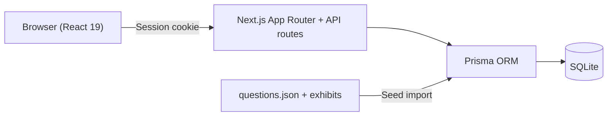

## Problem

To prepare for the Cisco CCNA certification, I wanted to practise in a targeted way with my
own question bank — including the exhibits (network diagrams, CLI output) that are the real
core of many questions. The available tools were either too inflexible for me or kept the
questions in formats that allowed neither a real exam simulation nor an evaluation by topic.

So I built the platform myself: more than 160 practice questions with locally stored exhibit
images, an exam mode with a time limit and evaluation, and personal statistics that show
strengths and weaknesses per topic — so I practise where it's needed instead of going round
in circles through the whole catalogue.

## Architecture

A Next.js 15 app (App Router) with API routes as the backend and Prisma on SQLite as the
database. SQLite is a deliberate choice for the MVP: no separate database server, trivial
backups — but the schema avoids SQLite specifics (enums as validated strings, JSON as text
columns), so a migration to PostgreSQL remains possible at any time.

The platform supports multiple users: registration only with an invitation code, session
auth with httpOnly cookies, session rotation on login (OWASP) and an audit log for
security-relevant actions. Zod validates input at the API boundary, bcrypt hashes passwords.
The question bank is seeded into the database from a JSON file — idempotently, so new or
corrected questions flow in with another seed run without touching user data.

## Deployment in the homelab

The app runs as an unprivileged LXC on my Proxmox host, following the same pattern as my
other services: Debian base, its own IP in the server VLAN, autostart, storage on the ZFS
pool. The deployment itself is deliberately simple — project tarball, `npm ci`, Prisma
schema push, seed, production build and a small systemd unit with `Restart=on-failure`. The
platform is reachable via its own subdomain with TLS.

Things got interesting at the first login test: the login went through on the server
without errors, but the browser kept landing back on the login page. A `curl` against the
login API showed the cause in the `Set-Cookie` header — the session cookie carried the
`Secure` flag (tied to `NODE_ENV=production`), while I was still testing over plain HTTP.
Browsers silently discard `Secure` cookies over HTTP. The fix: the flag stays the default in
production but can be explicitly overridden via an environment variable — a documented,
temporary exception that was removed again after the switch to TLS.

## Learnings

- **`NODE_ENV=production` is not a synonym for HTTPS.** Tying cookie flags to it builds in
  a hidden assumption that strikes exactly when you test without TLS.
- **Proof first, then the fix.** A single targeted `curl` against the login API narrowed
  the problem down unambiguously before anything was changed.
- **Migration readiness costs almost nothing in an MVP** — avoiding SQLite specifics was
  trivial and keeps the path to PostgreSQL open.
- **Reused deployment patterns pay off:** because all containers follow the same scheme,
  the new service was in production, debugging included, in under an hour.
