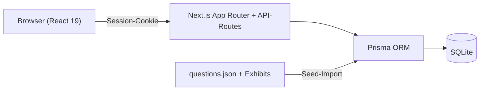

## Problem

Für die Vorbereitung auf die Cisco-CCNA-Zertifizierung wollte ich gezielt mit einem
eigenen Fragenkatalog üben — inklusive der Exhibits (Netzwerk-Diagramme, CLI-Ausgaben),
die bei vielen Fragen den eigentlichen Kern ausmachen. Die verfügbaren Tools waren mir
entweder zu unflexibel oder hielten die Fragen in Formaten, mit denen sich weder eine
echte Prüfungssimulation noch eine Auswertung nach Themengebieten bauen ließ.

Also habe ich die Plattform selbst gebaut: über 160 Übungsfragen mit lokal abgelegten
Exhibit-Bildern, ein Prüfungsmodus mit Zeitlimit und Auswertung, und persönliche
Statistiken, die Stärken und Schwächen pro Themengebiet sichtbar machen — damit ich
dort übe, wo es nötig ist, statt den ganzen Katalog im Kreis zu drehen.

## Architektur

Eine Next.js-15-App (App Router) mit API-Routes als Backend und Prisma auf SQLite als
Datenbank. SQLite ist eine bewusste Entscheidung für den MVP: kein eigener
Datenbank-Server, triviale Backups — aber das Schema verzichtet auf SQLite-Spezifika
(Enums als validierte Strings, JSON als Text-Spalten), sodass eine Migration auf
PostgreSQL jederzeit möglich bleibt.

Die Plattform ist mehrbenutzerfähig: Registrierung nur mit Einladungscode,
Session-Auth mit httpOnly-Cookies, Session-Rotation beim Login (OWASP) und einem
Audit-Log für sicherheitsrelevante Aktionen. Eingaben validiert Zod an der API-Grenze,
Passwörter hasht bcrypt. Der Fragenkatalog wird aus einer JSON-Datei in die Datenbank
geseedet — idempotent, sodass neue oder korrigierte Fragen per erneutem Seed einfließen,
ohne Nutzerdaten anzufassen.

## Deployment im Homelab

Die App läuft als unprivilegierter LXC auf meinem Proxmox-Host, nach demselben Muster
wie meine übrigen Dienste: Debian-Basis, eigene IP im Server-VLAN, Autostart, Storage
auf dem ZFS-Pool. Der Deploy selbst ist bewusst einfach gehalten — Projekt-Tarball,
`npm ci`, Prisma-Schema-Push, Seed, Production-Build und eine kleine systemd-Unit mit
`Restart=on-failure`. Erreichbar ist die Plattform über eine eigene Subdomain mit TLS.

Spannend wurde es beim ersten Login-Test: Die Anmeldung lief serverseitig fehlerfrei
durch, aber der Browser landete immer wieder auf der Login-Seite. Ein `curl` gegen die
Login-API zeigte die Ursache im `Set-Cookie`-Header — das Session-Cookie trug das
`Secure`-Flag (gekoppelt an `NODE_ENV=production`), während ich noch per blankem HTTP
testete. Browser verwerfen `Secure`-Cookies über HTTP kommentarlos. Der Fix: das Flag
bleibt in Produktion der Default, lässt sich aber per Umgebungsvariable explizit
übersteuern — eine dokumentierte, temporäre Ausnahme, die nach dem Umstieg auf TLS
wieder entfernt wurde.

## Learnings

- **`NODE_ENV=production` ist kein Synonym für HTTPS.** Cookie-Flags daran zu koppeln
  baut eine versteckte Annahme ein, die genau dann zuschlägt, wenn man ohne TLS testet.
- **Erst Beweis, dann Fix.** Ein einziger gezielter `curl` auf die Login-API hat das
  Problem eindeutig eingegrenzt, bevor irgendetwas geändert wurde.
- **Migrationsfähigkeit kostet beim MVP fast nichts** — auf SQLite-Spezifika zu
  verzichten war trivial und hält den Weg zu PostgreSQL offen.
- **Wiederverwendete Deployment-Muster zahlen sich aus:** Weil alle Container demselben
  Schema folgen, war der neue Dienst inklusive Debugging in unter einer Stunde produktiv.
