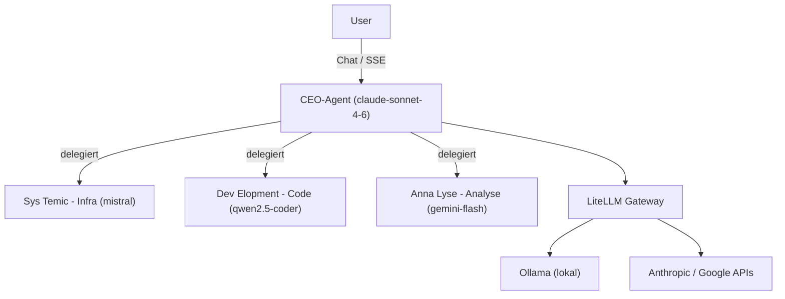

## Problem

Ein Homelab mit vielen Diensten und mehreren KI-Modellen braucht eine zentrale Steuer- und
Überwachungsstelle. Statt fünf Tabs und manuellem Modell-Routing sollte ein einziges
Dashboard Infrastruktur und KI-Agenten bündeln — mit einem Agenten, der Aufgaben versteht
und selbstständig an den passenden Spezialisten delegiert.

## Architektur

Ein Next.js-Dashboard visualisiert die Agenten als interaktives React-Flow-Organigramm. Der
CEO-Agent (claude-sonnet-4-6) erkennt Aufgaben und delegiert an drei Sub-Agenten, die je ein
lokales bzw. Cloud-Modell über ein einheitliches LiteLLM-Gateway nutzen. Delegations-Events
werden inline im Chat (SSE-Streaming) visualisiert.

## Stack

Frontend: Next.js + React Flow (Glassmorphism-Org-Chart, Alert-Panel, SSE-Chat), Auth via
Authentik (OIDC/NextAuth). Backend-Module: PostgreSQL 16 (Core), Ollama + LiteLLM
(AI-Compute), Grafana + Prometheus (Monitoring), n8n (Automation), Plane (Tickets), Outline
(Docs) — alles als Docker-Compose-Module.

## Learnings

- **LiteLLM als einheitliches Gateway** entkoppelt das Dashboard vom konkreten Modell — lokal
  (Ollama) und Cloud (Anthropic/Google) hinter einer API.
- **CEO-Delegation** macht Multi-Agenten-Routing für den Nutzer sichtbar, statt es zu
  verstecken — Delegation-Events laufen inline im Chat.
- **Modularer Compose-Aufbau** (core / ai-compute / monitoring / …) hält die Dienste
  unabhängig deploybar.
- Authentik-SSO lässt sich initial überspringen, ohne den Rest zu blockieren — wichtig für
  inkrementelles Hochziehen.
