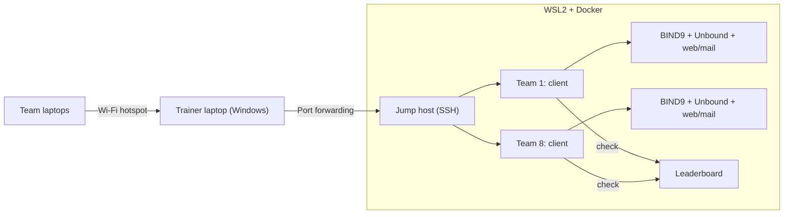

## The assignment

At vocational school, we were asked to design and deliver a training session in groups of
five, set up as an internal company training for second-year apprentices. Our topic was DNS.
The package included a presentation of about 15 minutes, a one-page handout, a short quiz, a
Q&A round and a practical part of 15 to 45 minutes.

The presentation and handout were created as a team. My part was the practical one: the lab
including the leaderboard and launch scripts.

I didn't want a click-through tutorial that everyone works through in lockstep. You learn
DNS by fixing broken resolution. So it turned into a small **capture-the-flag**: every team
gets its own, deliberately broken DNS environment and collects points for every fault it
fixes.

## The lab

Every team gets its own isolated subnet with an authoritative name server (**BIND9**), a
caching resolver (**Unbound**), a client with the usual tools, and a web and a mail server
as targets. The teams connect via SSH through a shared jump host, and the points come
together on a central leaderboard.

Every environment contains seven faults, graded by difficulty:

| # | Fault | Points |
|---|---|---|
| 1 | Wrong forwarder IP in the caching resolver | 100 |
| 2 | A record for the web server missing | 100 |
| 3 | MX record points to a CNAME (forbidden by RFC 2181) | 200 |
| 4 | SOA serial from 2020 | 200 |
| 5 | PTR record for the mail server missing | 200 |
| 6 | TTL set to 0, nothing gets cached | 300 |
| 7 | CNAME loop | 300 |

The teams work with a handful of commands: `status` shows open faults, `check <n>` checks a
fix automatically and, once solved, explains why it was a fault. `hint` gives hints in three
levels, from a conceptual nudge to a spoiler, and each level is supposed to cost a quarter of
the points. `solve` shows the complete solution and is supposed to cost the team **all** of
its points so far. The first team to solve a fault gets a 50-point **first blood** bonus. The
leaderboard is reachable for everyone in the browser and refreshes every five seconds.

## The real effort: a double-click

Building in the DNS faults was the smaller part. The hard part was making the whole thing
start reliably on an ordinary Windows laptop on the day of the training: without a server,
without depending on the local network, and without me typing commands in front of the
class.

In the end, a double-click on a `.bat` file on the desktop was all it took. It requests admin
rights, starts the mobile hotspot, sets up port forwarding and firewall rules and brings up
all the team containers in WSL2. The teams connect to the hotspot and log in via SSH.

The road there was mainly a series of Windows quirks. On just two days in mid-April, 22
commits were made, 17 of them fixes:

- **PowerShell 5 is not PowerShell 7.** The preinstalled Windows PowerShell doesn't know
  `&&` and `||`. Bash commands embedded as strings in the script therefore broke the parser.
  On top of that came encoding errors and warnings on stderr that PowerShell 5 treated as a
  failure.
- **WSL2 sleeps.** After a Windows reboot, WSL2 has no IP until it has been started once.
  The launch script now actively wakes it up before setting up the port forwarding.
- **A leaderboard that overwrites itself.** Each team's score display wrote its own,
  outdated state back every 15 seconds, overwriting real results. Since then, only `check`
  and `status` report results, and the state lives outside the containers so it survives a
  restart.
- **A bug in the old docker-compose** (`ContainerConfig`) prevented containers from being
  recreated. The solution: remove old team containers deliberately before every start.

## Addendum: a bug I only noticed while writing

While going through the code again for this article, I noticed that the penalties don't
work the way the lab announces them to the teams.

The first version of `solve` really did set the team's points to 0. But on the next `check`,
the leaderboard recalculated the points from the solved tasks, and the penalty was gone. My
fix the same day was meant to make it permanent: the task given up via `solve` is marked and
never counts again. In the process, resetting all points quietly fell out. Since then,
`solve` only costs the points of that one task. The announced deduction for hints isn't
applied anywhere either.

So the warnings in the lab are stricter than the implementation. It was meant to be the
other way round.

In the training itself it didn't matter: not a single team used `solve`. Every team wanted to
be at the top of the leaderboard and preferred to fight its way through on its own. Ambition
replaced the penalty before it ever had to kick in.

## Result

In the training, 27 classmates worked in the lab in parallel in seven teams. It went down
well with the class and the teacher. The whole package of presentation, Q&A and training was
graded: the whole team landed between "very good" and "good", and I got a 1+ (the top
grade).

## Learnings

- **Fix what's broken instead of following instructions.** A lab where something is broken
  forces exactly the approach you want to teach: first ask the authoritative server, then
  the cache, then compare.
- **The environment is the risk, not the content.** The DNS faults were built in quickly.
  Most of the time went into a reliable start on a Windows machine that had just been
  rebooted, was asleep or had a different PowerShell.
- **Game mechanics steer behaviour.** Graded hints and an expensive full solution are meant
  to make teams get a small nudge first rather than the finished solution. That keeps the
  teams working on the problem themselves.
- **Game rules need tests too.** Every DNS fix is checked automatically, but there was no
  such test for the scoring rules. A single test "after `solve` and another `check`, the team
  has 0 points" would have revealed the bug immediately.
- **Everything in one repo.** Presentation, handout, quiz and lab live together and can be
  set up on a new machine with a bootstrap script.
