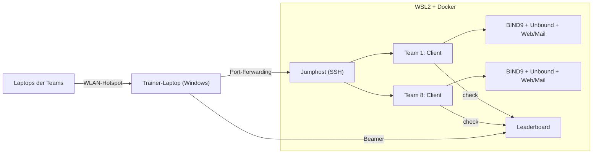

## Auftrag

Im Rahmen der Berufsschule sollte ich eine Schulung konzipieren und halten, im Szenario
einer internen Betriebsschulung für Azubis im zweiten Lehrjahr. Mein Thema war DNS. Zum
Paket gehörten eine Präsentation von etwa 15 Minuten, ein einseitiges Handout, ein kurzes
Quiz und ein praktischer Teil von 15 bis 45 Minuten.

Für den praktischen Teil wollte ich keine Klick-Anleitung, die alle im Gleichschritt
abarbeiten. DNS lernt man, indem man kaputte Auflösung repariert. Also wurde daraus ein
kleines **Capture-the-Flag**: Jedes Team bekommt seine eigene, absichtlich fehlerhafte
DNS-Umgebung und sammelt Punkte für jeden behobenen Fehler.

> **TODO Lars:** Wann hast du die Schulung gehalten, wie viele Teams haben mitgemacht und
> wie kam es an? Ein, zwei Sätze zur Durchführung (und gern die Bewertung, falls du sie
> nennen magst) machen die Case Study rund.

## Das Lab

Jedes Team bekommt ein eigenes, isoliertes Subnetz mit einem autoritativen Nameserver
(**BIND9**), einem Caching-Resolver (**Unbound**), einem Client mit den üblichen Werkzeugen
sowie einem Web- und einem Mailserver als Ziele. Die Teams verbinden sich per SSH über
einen gemeinsamen Jumphost, die Punkte laufen auf einem zentralen Leaderboard zusammen.

In jeder Umgebung stecken sieben Fehler, nach Schwierigkeit gestaffelt:

| # | Fehler | Punkte |
|---|---|---|
| 1 | Falsche Forwarder-IP im Caching-Resolver | 100 |
| 2 | A-Record für den Webserver fehlt | 100 |
| 3 | MX-Record zeigt auf einen CNAME (verboten laut RFC 2181) | 200 |
| 4 | SOA-Serial aus dem Jahr 2020 | 200 |
| 5 | PTR-Record für den Mailserver fehlt | 200 |
| 6 | TTL auf 0, nichts wird gecacht | 300 |
| 7 | CNAME-Schleife | 300 |

Die Teams arbeiten mit einer Handvoll Befehle: `status` zeigt offene Fehler, `check <n>`
prüft einen Fix automatisch und erklärt nach dem Lösen, warum das ein Fehler war. `hint`
gibt Hinweise in drei Stufen, jede kostet ein Viertel der Punkte. `solve` zeigt die
komplette Lösung, kostet aber **alle** bisherigen Punkte des Teams. Wer einen Fehler als
erstes Team löst, bekommt 50 Punkte **First Blood** dazu. Das Leaderboard aktualisiert sich
alle fünf Sekunden und läuft während der Übung auf dem Beamer.

## Der eigentliche Aufwand: ein Doppelklick

Die DNS-Fehler einzubauen war der kleinere Teil. Aufwendig war, dass das Ganze am
Schulungstag auf einem normalen Windows-Laptop zuverlässig startet: ohne Server, ohne
Abhängigkeit vom Netz vor Ort und ohne dass ich vor der Klasse Befehle tippen muss.

Am Ende reichte ein Doppelklick auf eine `.bat`-Datei auf dem Desktop. Sie holt sich
Admin-Rechte, startet den mobilen Hotspot, richtet Port-Forwarding und Firewall-Regeln ein
und fährt in WSL2 alle Container für die Teams hoch. Die Teams verbinden sich mit dem
Hotspot und loggen sich per SSH ein.

Der Weg dahin war vor allem eine Reihe von Windows-Eigenheiten. Allein an zwei Tagen Mitte
April entstanden 22 Commits, 17 davon Fixes:

- **PowerShell 5 ist nicht PowerShell 7.** Das vorinstallierte Windows PowerShell kennt
  `&&` und `||` nicht. Bash-Befehle, die als String im Skript standen, brachen deshalb den
  Parser. Dazu kamen Encoding-Fehler und Warnungen auf stderr, die PowerShell 5 als
  Abbruch wertete.
- **WSL2 schläft.** Nach einem Windows-Neustart hat WSL2 keine IP, bis es einmal gestartet
  wurde. Das Startskript weckt es jetzt aktiv auf, bevor es die Port-Weiterleitung setzt.
- **Ein Leaderboard, das sich selbst überschreibt.** Die Punkteanzeige pro Team schrieb alle
  15 Sekunden ihren eigenen, veralteten Stand zurück und überschrieb damit echte Ergebnisse.
  Seitdem melden nur noch `check` und `status` Ergebnisse, und der Stand liegt außerhalb der
  Container, damit er einen Neustart übersteht.
- **Ein Bug im alten docker-compose** (`ContainerConfig`) verhinderte das Neuerstellen von
  Containern. Die Lösung: alte Team-Container vor jedem Start gezielt entfernen.

## Learnings

- **Kaputtes reparieren statt Anleitung abarbeiten.** Ein Lab, in dem etwas kaputt ist,
  zwingt zu genau dem Vorgehen, das man vermitteln will: erst den autoritativen Server
  fragen, dann den Cache, dann vergleichen.
- **Die Umgebung ist das Risiko, nicht der Inhalt.** Die DNS-Fehler waren schnell
  eingebaut. Die meiste Zeit ging in einen verlässlichen Start auf einem Windows-Rechner,
  der vorher neu gestartet wurde, schlief oder eine andere PowerShell hatte.
- **Spielmechanik steuert Verhalten.** Die Punkteregeln sind bewusst so gebaut: `solve`
  kostet alles, ein Hinweis nur ein Viertel. Damit lohnt sich der kleine Schubs mehr als die
  fertige Lösung, und die Teams bleiben selbst am Problem.
- **Alles in einem Repo.** Präsentation, Handout, Quiz und Lab liegen zusammen und lassen
  sich per Bootstrap-Skript auf einem neuen Rechner aufsetzen.
