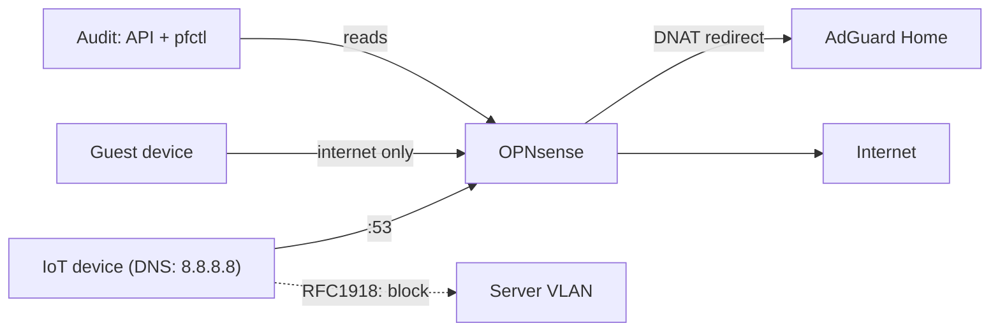

## Problem

After the VLAN segmentation, the network was divided into zones, but not yet secured:
implicit "everyone talks to everyone" paths, DNS queries bypassing my own resolver (smart
TVs with a hard-coded `8.8.8.8`), and documentation that had drifted away from reality. The
goal: true default deny — every allowed connection is an explicit, documented rule — plus
DNS hijack protection that can't be bypassed. And regular audits that prove it.

## Architecture

Around 70 filter rules on OPNsense enforce default deny between the zones: IoT can't reach
any RFC1918 network, guests only see the internet, the DMZ is proactively isolated. DNAT
redirects catch every outgoing `:53` packet and transparently steer it to the AdGuard
resolver — no matter which DNS server a device has configured. Kea hands out the respective
VLAN gateway IP as the resolver via DHCP, so the redirect takes effect right at the firewall.

## Stack

OPNsense with pf as the packet filter, fully administrable and auditable via the REST API
(`searchRule`, `getRule`, config XML). Verification in the live kernel via `pfctl -vvsr`
(rules including hit counters), `pfctl -sn` (NAT/redirects) and `pfctl -ss` (state table).
AdGuard Home as the central resolver, Kea DHCP per VLAN.

## Learnings

- **Never blindly trust a single API view:** `searchRule` showed `destination_port: null`
  for the DNAT rules — it looked like a total failure of the DNS hijack protection. Only
  `getRule` and the raw config XML showed: everything active and correct. Different
  endpoints deliver different partial truths.
- **Rule names are statements of intent, not proof:** according to its hit counter, the
  explicit DNS allow rule let zero packets through — and the system still worked, because
  the DHCP-distributed gateway DNS path uses the DNAT redirect. Without `pfctl` and hit
  counters, I would have "fixed" something that wasn't broken.
- **Audits find real errors:** four dead or redundant rules removed — including two
  `any:53` allow rules that undermined the hijack block in the evaluation order. Only after
  that was the protection a real enforcer instead of decoration.
- **Cross-verify every change:** backup first, change via the API, then a check in the live
  pf kernel. The GUI is a curated view — the packet filter is the only source of truth.
