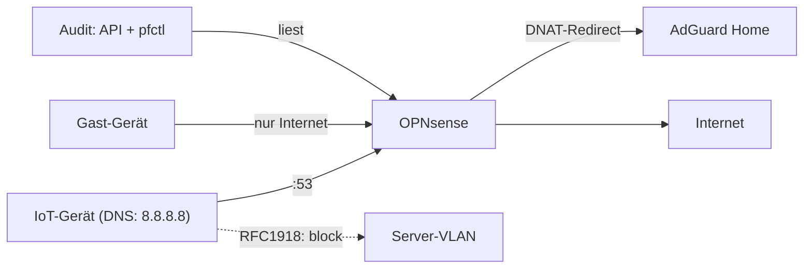

## Problem

Nach der VLAN-Segmentierung war das Netz zwar in Zonen geteilt, aber noch nicht
abgesichert: implizite „alle reden mit allen"-Pfade, DNS-Anfragen, die am eigenen
Resolver vorbeiliefen (Smart-TVs mit hartkodiertem `8.8.8.8`), und eine Doku, die mit
der Realität auseinanderlief. Ziel: echtes Default-Deny — jede erlaubte Verbindung ist
eine explizite, dokumentierte Regel — plus ein DNS-Hijack-Schutz, der sich nicht umgehen
lässt. Und regelmäßige Audits, die das auch beweisen.

## Architektur

Rund 70 Filter-Regeln auf der OPNsense setzen Default-Deny zwischen den Zonen durch:
IoT erreicht kein RFC1918-Netz, Gäste sehen nur das Internet, die DMZ ist proaktiv
isoliert. DNAT-Redirects fangen jedes ausgehende `:53`-Paket ab und lenken es transparent
auf den AdGuard-Resolver — egal, welchen DNS-Server ein Gerät eingestellt hat. Kea
verteilt per DHCP die jeweilige VLAN-Gateway-IP als Resolver, sodass der Redirect direkt
an der Firewall greift.

## Stack

OPNsense mit pf als Paketfilter, vollständig über die REST-API administrier- und
auditierbar (`searchRule`, `getRule`, Config-XML). Verifikation im Live-Kernel per
`pfctl -vvsr` (Regeln samt Trefferzählern), `pfctl -sn` (NAT/Redirects) und `pfctl -ss`
(State-Table). AdGuard Home als zentraler Resolver, Kea DHCP je VLAN.

## Learnings

- **Einer einzelnen API-Sicht nie blind vertrauen:** `searchRule` zeigte für die
  DNAT-Regeln `destination_port: null` — sah aus wie ein Totalausfall des
  DNS-Hijack-Schutzes. Erst `getRule` und das rohe Config-XML zeigten: alles aktiv und
  korrekt. Verschiedene Endpoints liefern verschiedene Teilwahrheiten.
- **Regelnamen sind Absichtserklärungen, kein Beweis:** Die explizite
  DNS-Erlaubnis-Regel ließ laut Trefferzähler null Pakete durch — das System
  funktionierte trotzdem, weil der DHCP-verteilte Gateway-DNS-Pfad den DNAT-Redirect
  nutzt. Ohne `pfctl` und Trefferzähler hätte ich „repariert", was nicht kaputt war.
- **Audits finden echte Fehler:** Vier tote bzw. redundante Regeln entfernt — darunter
  zwei `any:53`-Erlaubnisse, die den Hijack-Block in der Eval-Reihenfolge aushebelten.
  Erst danach war der Schutz ein echter Enforcer statt Dekoration.
- **Jede Änderung gegenverifizieren:** Backup vorher, Änderung über die API, danach
  Kontrolle im Live-pf-Kernel. Die GUI ist eine kuratierte Sicht — der Paketfilter ist
  die einzige Quelle der Wahrheit.
