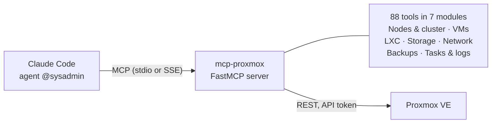

## Problem

In March I wanted an AI agent in Claude Code not just to describe my homelab, but to operate it:
check which containers are running, take a snapshot before an update, read a node's journal,
inspect a backup job. That's exactly what the **Model Context Protocol (MCP)** is for: an MCP
server provides tools that an agent can call with clear parameters, instead of guessing shell
commands.

So I built my own server that maps the Proxmox VE REST API to tools as completely as makes sense.

## Architecture

The server is a Python package built on **FastMCP**. A lean API client talks to the Proxmox API
via `httpx` and authenticates with an API token instead of a password. The tools live in seven
modules that register themselves with the server at startup.

| Module | Tools | Examples |
|---|---|---|
| VMs | 22 | start, stop, clone, snapshots, migration, change configuration |
| LXC containers | 16 | the same for containers, including snapshots |
| Network & firewall | 14 | bridges, interfaces, SDN, firewall rules |
| Nodes & cluster | 12 | status, resources, services, available updates |
| Backups | 9 | create and inspect backup jobs, instant backup, restore |
| Tasks & logs | 8 | running tasks, task logs, syslog, journal |
| Storage | 7 | storage and contents, ISO download, templates, backups |

The server runs locally with `uv` or as a Docker container. In my setup at the time, it ran in WSL
behind a gateway that made it reachable for Claude Code via SSE.

## How it was built

The server was **specified by me, implemented with AI assistance and reviewed**. I defined which
areas to cover, what the tools are called and which parameters they take; the AI wrote most of
the code to those specifications, and I reviewed it.

Two decisions shape the code:

- **One pattern for every tool.** Each tool has a short description for the agent, typed
  parameters and the same flow: determine the node, call the API, return the result. With 88
  tools, consistency matters more than elegance in any single case.
- **Sensible defaults.** If no node is given, every tool uses the first one that's online. In a
  single-node homelab, that saves the agent a step on every call.

## What I'd do differently today

Looking back, I'd be stricter about security. This is the part I learned the most from:

- **Fewer privileges for the token.** The instructions do recommend a dedicated API user, but they
  also suggest disabling the token's privilege separation for full access. Today I'd limit the
  token to the roles the tools actually need, and run read-only and write tools with separate
  tokens.
- **TLS verification on by default.** Certificate verification is off by default because Proxmox
  ships with a self-signed certificate. It's better to install your own CA's certificate and keep
  verification on.
- **Confirmation in the code, not just in the instructions.** The server instructs the agent to
  get confirmation before destructive actions such as deleting or shutting down. That's a request
  to the model, not a technical barrier. A real barrier — say, a switch that only registers write
  tools when explicitly enabled — would be more robust.

## Status

At the end of September I archived the repo while tidying up my projects; my AI setup works
differently now (more on that in the post [Three Attempts, One Brain](/en/blog/ki-setup-drei-anlaeufe)).
The code stays public as a reference for how to make a large REST API accessible to AI agents.

## Learnings

- **An agent is only as good as its tools.** Clear names, short descriptions and typed parameters
  decide whether an agent finds the right tool.
- **AI-assisted doesn't mean unreviewed.** The speed came from the AI; the responsibility for each
  of the 88 functions was mine.
- **Security belongs in the code.** What an agent must not do, it should be technically unable to
  do — not merely asked not to.
