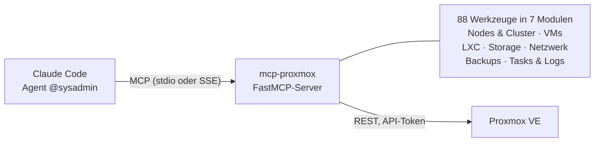

## Problem

Im März wollte ich, dass ein KI-Agent in Claude Code mein Homelab nicht nur beschreibt, sondern
bedienen kann: nachsehen, welche Container laufen, einen Snapshot vor einem Update anlegen, das
Journal eines Nodes lesen, einen Backup-Job prüfen. Das **Model Context Protocol (MCP)** ist
genau dafür da: Ein MCP-Server stellt Werkzeuge bereit, die ein Agent mit klaren Parametern
aufrufen kann, statt Shell-Befehle zu raten.

Also habe ich einen eigenen Server gebaut, der die Proxmox-VE-REST-API so vollständig wie
sinnvoll als Werkzeuge abbildet.

## Architektur

Der Server ist ein Python-Paket auf Basis von **FastMCP**. Ein schlanker API-Client spricht per
`httpx` mit der Proxmox-API und authentifiziert sich mit einem API-Token statt mit einem
Passwort. Die Werkzeuge liegen in sieben Modulen, die sich beim Start am Server registrieren.

| Modul | Werkzeuge | Beispiele |
|---|---|---|
| VMs | 22 | starten, stoppen, klonen, Snapshots, Migration, Konfiguration ändern |
| LXC-Container | 16 | dasselbe für Container, inklusive Snapshots |
| Netzwerk & Firewall | 14 | Bridges, Interfaces, SDN, Firewall-Regeln |
| Nodes & Cluster | 12 | Status, Ressourcen, Dienste, verfügbare Updates |
| Backups | 9 | Backup-Jobs anlegen und prüfen, Sofort-Backup, Restore |
| Tasks & Logs | 8 | laufende Tasks, Task-Logs, Syslog, Journal |
| Storage | 7 | Speicher und Inhalte, ISO-Download, Vorlagen, Backups |

Betreiben lässt sich der Server lokal mit `uv` oder als Docker-Container. In meinem damaligen
Setup lief er in WSL hinter einem Gateway, das ihn per SSE für Claude Code erreichbar machte.

## Arbeitsweise

Der Server ist **von mir spezifiziert, KI-gestützt umgesetzt und reviewt**. Ich habe festgelegt,
welche Bereiche abgedeckt werden, wie Werkzeuge heißen und welche Parameter sie bekommen; den
Großteil des Codes hat die KI nach diesen Vorgaben geschrieben, und ich habe ihn reviewt.

Zwei Entscheidungen prägen den Code:

- **Ein Muster für alle Werkzeuge.** Jedes Werkzeug hat eine knappe Beschreibung für den Agenten,
  typisierte Parameter und denselben Ablauf: Node ermitteln, API aufrufen, Ergebnis
  zurückgeben. Bei 88 Werkzeugen ist Einheitlichkeit wichtiger als Eleganz im Einzelfall.
- **Sinnvolle Vorgaben.** Ohne Angabe eines Nodes nimmt jedes Werkzeug den ersten, der online
  ist. Für ein Homelab mit einem Node spart das dem Agenten bei jedem Aufruf einen Schritt.

## Was ich heute anders machen würde

Rückblickend würde ich bei der Sicherheit strenger vorgehen. Das ist der Teil, aus dem ich am
meisten gelernt habe:

- **Weniger Rechte für das Token.** Die Anleitung empfiehlt zwar einen eigenen API-Nutzer, rät
  aber auch, die Rechtetrennung des Tokens für vollen Zugriff abzuschalten. Heute würde ich das
  Token auf die Rollen beschränken, die die Werkzeuge wirklich brauchen, und lesende und
  schreibende Werkzeuge mit getrennten Tokens betreiben.
- **TLS-Prüfung standardmäßig an.** Die Zertifikatsprüfung ist per Vorgabe aus, weil Proxmox ein
  selbstsigniertes Zertifikat mitbringt. Besser ist es, das Zertifikat der eigenen CA zu
  hinterlegen und die Prüfung eingeschaltet zu lassen.
- **Bestätigung im Code, nicht nur in der Anweisung.** Der Server weist den Agenten an,
  zerstörerische Aktionen wie Löschen oder Herunterfahren vorher bestätigen zu lassen. Das ist
  eine Bitte an das Modell, keine technische Sperre. Eine echte Sperre, etwa ein Schalter, der
  schreibende Werkzeuge nur auf ausdrücklichen Wunsch registriert, wäre robuster.

## Stand

Ende September habe ich das Repo beim Aufräumen meiner Projekte archiviert; mein KI-Setup läuft
inzwischen anders (mehr dazu im Beitrag [Drei Anläufe, ein Gehirn](/blog/ki-setup-drei-anlaeufe)).
Der Code bleibt öffentlich als Referenz dafür, wie man eine große REST-API für KI-Agenten
zugänglich macht.

## Learnings

- **Ein Agent ist nur so gut wie seine Werkzeuge.** Klare Namen, kurze Beschreibungen und
  typisierte Parameter entscheiden darüber, ob ein Agent das richtige Werkzeug findet.
- **KI-gestützt heißt nicht ungeprüft.** Die Geschwindigkeit kam von der KI, die Verantwortung
  für jede der 88 Funktionen lag bei mir.
- **Sicherheit gehört in den Code.** Was ein Agent nicht darf, sollte er technisch nicht können,
  statt es nur nicht zu sollen.
