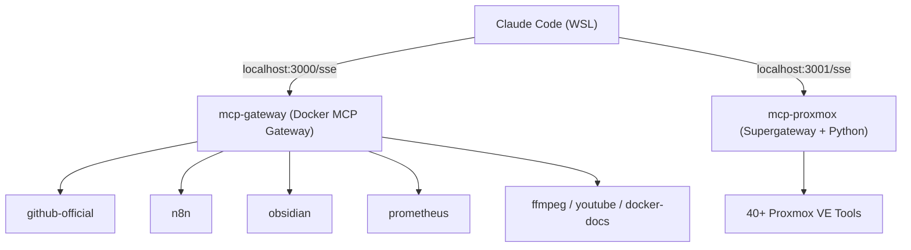

## Problem

Claude Code soll in WSL auf viele Werkzeuge zugreifen — GitHub, n8n, Obsidian, Prometheus,
ffmpeg, Proxmox — ohne für jeden Server eine eigene fragile Einzelkonfiguration. Gebraucht
wurde ein stabiler, neustartfester Verbund, der mehrere MCP-Server hinter wenigen Endpunkten
bündelt.

## Architektur

Zwei Gateways laufen als systemd-managed Docker-Dienste in WSL und exponieren je einen
SSE-Endpoint. Das Docker-MCP-Gateway bündelt die Catalog-Server (per `registry.yaml`),
ein zweites Gateway (Supergateway + Python) stellt 40+ Proxmox-VE-Tools bereit.

## Stack

Docker MCP Gateway (Catalog-Server via `registry.yaml`/`config.yaml`), Supergateway + Python
für den Proxmox-Server, systemd für Lifecycle/Neustart, Secrets via `.env` (GitHub-Token,
Obsidian/n8n-Keys, Proxmox-Token).

## Learnings

- **Zwei spezialisierte Gateways** statt eines Monolithen: Catalog-Server und der dicke
  Proxmox-Server bleiben unabhängig.
- **systemd-managed Docker in WSL** macht den Stack neustartfest — kein manuelles
  Hochfahren nach jedem WSL-Restart.
- **SSE-Endpunkte** sind die saubere Brücke zwischen Claude Code und den containerisierten
  MCP-Servern.
- Server lassen sich über `registry.yaml` deklarativ ein-/ausschalten, ohne Code-Änderung.
