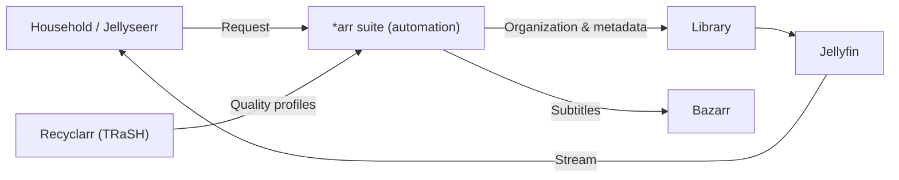

## Problem

A legally acquired media collection that has grown over the years — Blu-ray and DVD rips of
my own discs, my own recordings, purchased content — scattered across several drives is
practically unusable. The goal was a unified, automated library: clean metadata,
multilingual subtitles, normalized quality and streaming to every device — fully
self-hosted, without the cloud, cleanly integrated into a VLAN-segmented homelab.

## Architecture

Everything runs in an unprivileged Proxmox LXC in the server VLAN on linuxserver.io images.
Jellyseerr takes requests from the household, the *arr suite automates organization,
renaming, metadata and library monitoring, Recyclarr enforces reproducible TRaSH guide
quality profiles, Bazarr adds subtitles, Jellyfin streams to every device.

## Stack

Jellyfin as the media server, Sonarr/Radarr/Prowlarr for library automation and metadata,
SABnzbd as the download client, Recyclarr for reproducible quality profiles, Bazarr for
multilingual subtitles — as containers in an LXC (Debian 12, 4 vCPU / 8 GB), storage on ZFS
(`tank-storage`).

## Learnings

- **An unprivileged LXC with targeted capabilities** is the right balance between security
  and hardware access — no fully privileged container needed.
- **Recyclarr** makes quality profiles versionable and reproducible instead of maintaining
  them by hand in every *arr app.
- **VLAN segmentation (a dedicated server VLAN)** cleanly separates the media services from
  the rest of the network.
- **GPU transcoding (NVIDIA NVENC)** has been running since June: the host's GTX 1050 is
  passed through to the unprivileged LXC via a device mount, and NVENC including tone
  mapping manages around 4.5× real time in testing.
