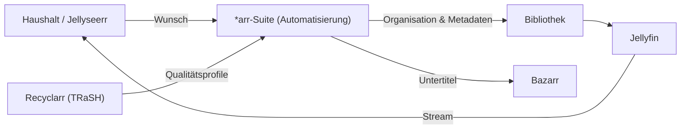

## Problem

Eine über Jahre gewachsene, rechtmäßig erworbene Mediensammlung — Blu-ray- und DVD-Rips der
eigenen Discs, Eigenaufnahmen, gekaufte Inhalte — verstreut über mehrere Platten ist praktisch
unbrauchbar. Ziel war eine einheitliche, automatisierte Bibliothek: saubere Metadaten,
mehrsprachige Untertitel, normalisierte Qualität und Streaming auf alle Geräte — vollständig
self-hosted, ohne Cloud, sauber in ein VLAN-segmentiertes Homelab integriert.

## Architektur

Alles läuft in einem unprivilegierten Proxmox-LXC (114, `10.17.10.14`, VLAN 10 SRV) auf
linuxserver.io-Images. Jellyseerr nimmt Wünsche aus dem Haushalt entgegen, die *arr-Suite
automatisiert Organisation, Umbenennung, Metadaten und Bibliotheks-Monitoring, Recyclarr
erzwingt reproduzierbare TRaSH-Guide-Qualitätsprofile, Bazarr ergänzt Untertitel, Jellyfin
streamt auf alle Geräte.

## Stack

Jellyfin als Medienserver, Sonarr/Radarr/Prowlarr für Bibliotheks-Automatisierung und
Metadaten, SABnzbd als Download-Client, Recyclarr für reproduzierbare Qualitätsprofile,
Bazarr für mehrsprachige Untertitel — als Container im LXC 114 (Debian 12, 4 vCPU / 8 GB),
Storage auf ZFS (`tank-storage`).

## Learnings

- **Unprivilegierter LXC mit gezielten Capabilities** ist die richtige Balance aus
  Sicherheit und Hardware-Zugriff — kein voller privilegierter Container nötig.
- **Recyclarr** macht Qualitätsprofile versionier- und reproduzierbar, statt sie manuell in
  jeder *arr-App zu pflegen.
- **VLAN-Segmentierung (VLAN 10 SRV)** trennt die Media-Dienste sauber vom restlichen Netz.
- **GPU-Transcoding (NVIDIA NVENC)** steht noch aus — CPU-Transcoding reicht aktuell, der
  Treiber-Durchgriff auf den Host ist der nächste Schritt.
