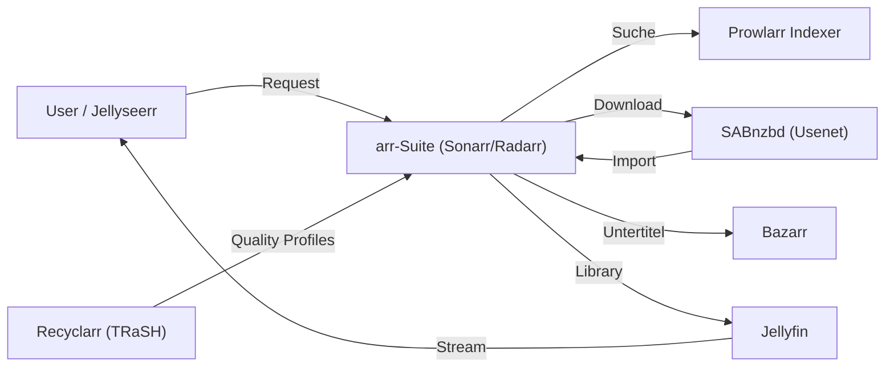

## Problem

Streaming-Abos sind teuer, fragmentiert und nehmen einem die Kontrolle über die eigene
Mediathek. Ziel war ein vollautomatischer, self-hosted Media-Stack: anfragen, beschaffen,
qualitätsnormalisieren, untertiteln und abspielen — ohne manuelle Handgriffe und sauber in
ein VLAN-segmentiertes Homelab integriert.

## Architektur

Alles läuft in einem unprivilegierten Proxmox-LXC (114, `10.17.10.14`, VLAN 10 SRV) auf
linuxserver.io-Images. Jellyseerr nimmt Requests entgegen, die *arr-Suite orchestriert
Suche und Download über Prowlarr-Indexer und SABnzbd (Usenet), Recyclarr erzwingt
TRaSH-Guide-Qualitätsprofile, Bazarr zieht Untertitel, Jellyfin streamt.

## Stack

Jellyfin als Player, Sonarr/Radarr/Prowlarr für Automation, SABnzbd als Usenet-Downloader,
Recyclarr für reproduzierbare Quality-Profile, Bazarr für mehrsprachige Untertitel — als
Container im LXC 114 (Debian 12, 4 vCPU / 8 GB), Storage auf ZFS (`tank-storage`).

## Learnings

- **Unprivilegierter LXC mit gezielten Capabilities** ist die richtige Balance aus
  Sicherheit und Hardware-Zugriff — kein voller privilegierter Container nötig.
- **Recyclarr** macht Qualitätsprofile versionier- und reproduzierbar, statt sie manuell in
  jeder *arr-App zu pflegen.
- **VLAN-Segmentierung (VLAN 10 SRV)** trennt die Media-Dienste sauber vom restlichen Netz.
- **GPU-Transcoding (NVIDIA NVENC)** steht noch aus — CPU-Transcoding reicht aktuell, der
  Treiber-Durchgriff auf den Host ist der nächste Schritt.
