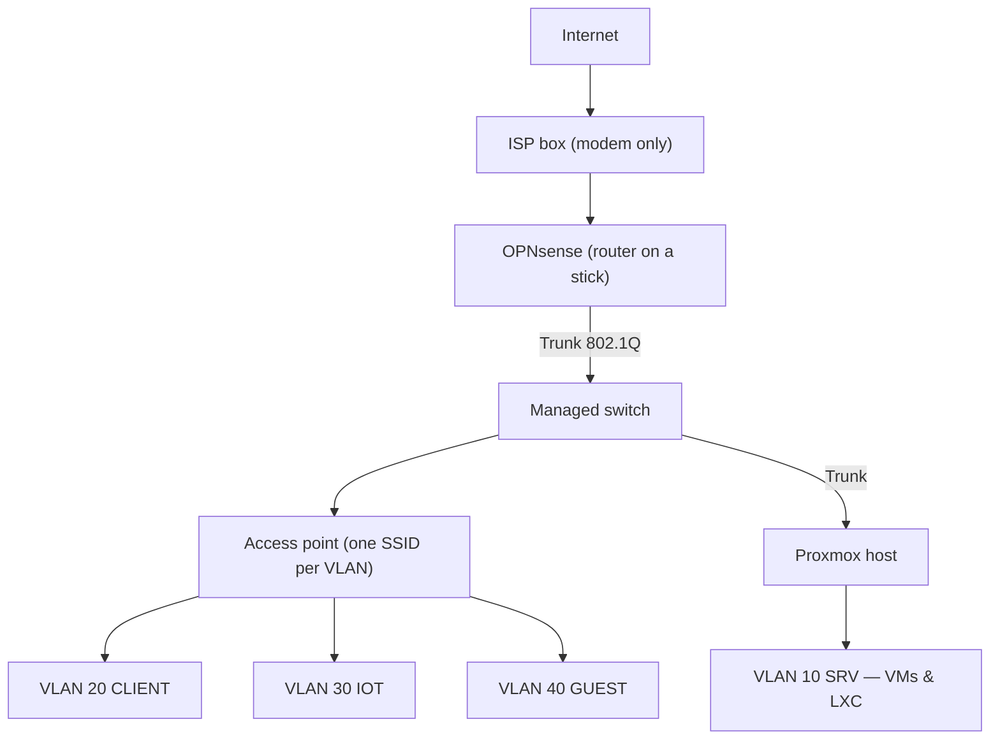

## Problem

The entire homelab ran in a single flat `/24` behind the ISP's router box: smart TV, work
PC, Proxmox host and password manager in the same broadcast segment, port forwards directly
on the ISP box — confusing, not versionable, not documentable. The goal was a
router-on-a-stick setup with a real firewall, tagged VLANs and a topology that can be
documented and reproduced.

## Architecture

A Sophos appliance flashed with OPNsense replaces the ISP box as router and firewall; the box
now only runs as a modem. Behind it, a VLAN-capable switch distributes six zones, an access
point maps Wi-Fi SSIDs to VLANs, and the Proxmox host hangs off a trunk port — every VM and
every LXC gets its segment via a VLAN tag on the virtual bridge port, without any additional
physical NICs.

The zones: MGMT (OPNsense, switch, Proxmox host), SRV (servers & VMs), CLIENT (work PCs),
IOT (smart home and everything untrusted), GUEST (fully isolated) and DMZ (services exposed
to the outside).

## Stack

OPNsense on a reflashed Sophos appliance as the central firewall, 802.1Q VLANs via a managed
switch, Kea as the DHCP server per VLAN, Proxmox with a VLAN-aware bridge on the trunk port.
The inventory of the old port forwards was API-based — an AI assistant read out the current
state of the rules and sped up the documentation considerably.

## Learnings

- **The dumb-AP trap:** the first access point swallowed VLAN tags without complaint — but
  its management interface ended up in the wrong segment. Locked myself out, rescue only via
  the serial console. The AP management VLAN has to be pinned down *before* tagging the
  SSIDs.
- **Duplicate DHCP:** as long as the ISP box and OPNsense were handing out leases in
  parallel, there were sporadic duplicate IPs. It only became stable once the box really was
  just a modem.
- **Segmentation is the foundation, not the goal:** only with the VLANs in place could I
  switch to default deny step by step — IoT no longer sees the server network, guests only
  see the internet, and every inter-VLAN connection is an explicit, documented rule.
