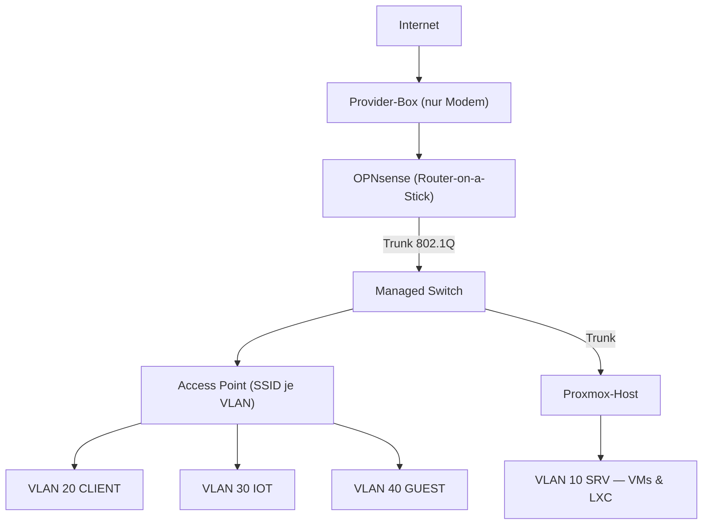

## Problem

Das gesamte Homelab lief in einem einzigen flachen `/24` hinter der Router-Box des
Providers: Smart-TV, Arbeits-PC, Proxmox-Host und Passwort-Manager im selben
Broadcast-Segment, Portfreigaben direkt auf der Provider-Box — unübersichtlich, nicht
versionierbar, nicht dokumentierbar. Ziel war ein Router-on-a-Stick-Setup mit einer
echten Firewall, getaggten VLANs und einer Topologie, die sich dokumentieren und
reproduzieren lässt.

## Architektur

Eine mit OPNsense geflashte Sophos-Appliance ersetzt die Provider-Box als Router und
Firewall; die Box läuft nur noch als Modem. Dahinter verteilt ein VLAN-fähiger Switch
sechs Zonen, ein Access Point mappt WLAN-SSIDs auf VLANs, und der Proxmox-Host hängt an
einem Trunk-Port — jede VM und jeder LXC bekommt sein Segment per VLAN-Tag am virtuellen
Bridge-Port, ganz ohne zusätzliche physische NICs.

Die Zonen: MGMT (OPNsense, Switch, Proxmox-Host), SRV (Server & VMs), CLIENT
(Arbeits-PCs), IOT (Smart-Home und alles Unvertrauenswürdige), GUEST (vollständig
isoliert) und DMZ (nach außen exponierte Dienste).

## Stack

OPNsense auf einer umgeflashten Sophos-Appliance als zentrale Firewall, 802.1Q-VLANs
über einen Managed Switch, Kea als DHCP-Server je VLAN, Proxmox mit VLAN-aware Bridge
am Trunk-Port. Die Inventarisierung der alten Portfreigaben lief API-gestützt — ein
KI-Assistent las den Ist-Zustand der Regeln aus und beschleunigte die Dokumentation
erheblich.

## Learnings

- **Dumb-AP-Falle:** Der erste Access Point schluckte VLAN-Tags klaglos — aber sein
  Management-Interface landete im falschen Segment. Selbst ausgesperrt, Rettung nur über
  die serielle Konsole. Das AP-Management-VLAN gehört *vor* dem Tagging der SSIDs
  festgezogen.
- **DHCP-Doppelung:** Solange Provider-Box und OPNsense parallel Leases vergaben, gab es
  sporadische Doppel-IPs. Stabil wurde es erst, als die Box wirklich nur noch Modem war.
- **Segmentierung ist das Fundament, nicht das Ziel:** Erst mit den VLANs ließ sich
  Schritt für Schritt auf Default-Deny umstellen — IoT sieht das Server-Netz nicht mehr,
  Gäste sehen nur das Internet, und jede Inter-VLAN-Verbindung ist eine explizite,
  dokumentierte Regel.
